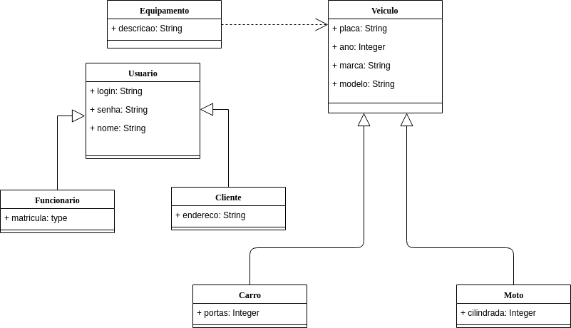
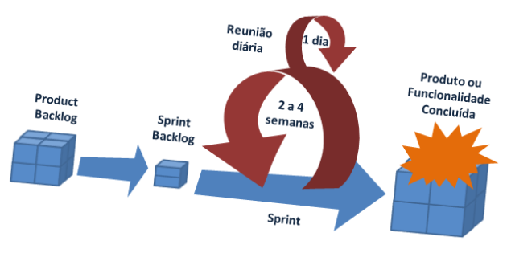

# Aula do dia 12/03/2019

## Projeto do curso
O projeto que iremos desenvolver no decorrer do curso é de uma locadora de veículos. Em seguida o diagrama de classes inicial das entidades:

Durante a aula abordamos apenas o relacionamento de herança (Carro e Moto **são** veículos), portanto o relacionamento entre Equipamento e Veiculo deve ser abstraído por hora. 

## Processo de desenvolvimento
Trabalharemos com o método scrum definido na figura abaixo:
