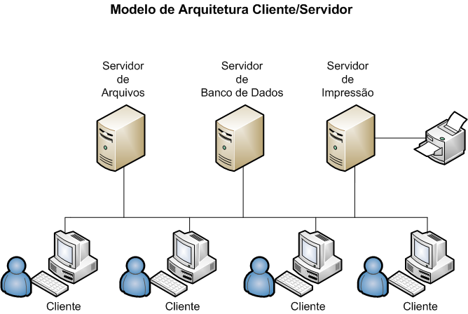
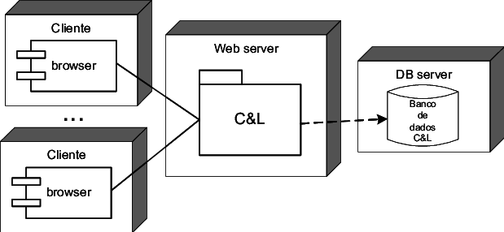
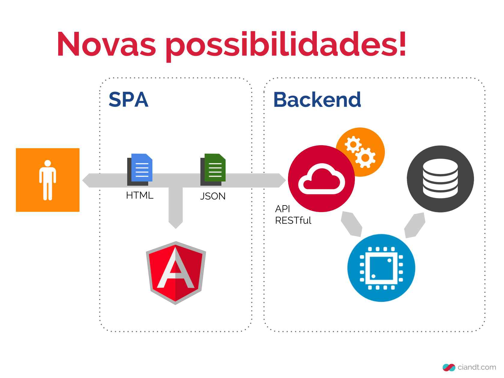

# Aula do dia 06/04/2019

## Mais refactoring

Já resolvemos os seguintes problemas:
 * código duplicado na conexão com o banco de dados
 * Magic values nos códigos de teste

Agora precisamos olhara para o código que geramos nos repositórios de Moto e Carro e analisar o que podemos melhorar.

Percebem algum problema ali? Podemos usar herança para reduzir o código duplicado?
 
## Reformulando nosso projeto final
Até agora trabalhamos em uma estrutua de projeto rudimentar, com algumas interações com o usuário via linha de comando e com alguns testes validando nossas principais lógicas. Agora vamos partir para uma realidade similar a utilizada em grandes projetos corporativos de software.

### Histórico
1. Cliente Servidor

Como funcionavam as arquiteturas de sistemas antes do grande *boom* dos sistemas web:

  

Na figura acima vimos um modelo tradicional de software cliente servidor. Antes da popularização da programação para web os softwares eram instalados diretamente nos clientes e compartilhavam dados através de instâncias de bancos de dados compartilhadas, compartilhamentos de rede, etc.
 * Problemas?
   * Complexidade de instalação/atualização
   * Necessidade de criação de múltiplos ambientes por "cliente"
   * Desenvolvimento pouco produtivo

2. Web 1.0

 
 
 * Problemas: 
     * Protocolo http stateless
     * Gerenciamento de sessão
     * Escalabilidade 
     * Usabilidade
     * Componentes Rich 
     
3. SPA com REST
Novos termos:
  * SPA - *Single Page Application*
  * REST - *Representational State Transfer*
  
   
   
  * Vantagens
      * Escalabilidade
      * View State totalmente do lado do cliente
      * Desenvolvimento produtivo
      * Quebra do monolito
  
  
   