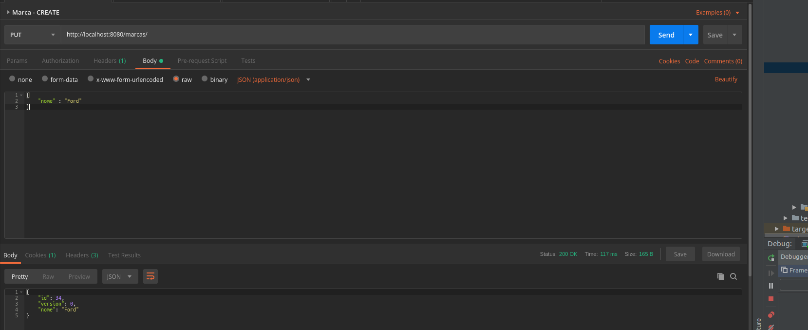

# Aula do dia 09/05/2019 

## Novas operações
Já vimos como criar nossos recursos em nossa API Rest, agora precisamos enriquecer um pouco mais a API com mais operações. Já temos duas operações com verbo GET, que, de acordo com o padrão, apenas lê (Retrieve) e não modifica o estado do recurso. Para modificação do estado precisamos usar os verbos PUT, POST e DELETE.

### Inclusão

Para inclusão utilizaremos o método PUT, com as seguintes anotações:
```java
...

	@PutMapping(consumes = MediaType.APPLICATION_JSON_UTF8_VALUE)
	public HttpEntity<Marca> createMarca(@Valid @RequestBody Marca marca) {
		if(marca == null || marca.getId() != null) {
			return ResponseEntity.badRequest().build();
		}
		return ResponseEntity.ok(marcaRepository.save(marca));		
	}
...
```

Podemos observar duas novas anotações no método acima:
 * @RequestBody - Essa anotação indica que receberemos um objeto complexo no corpo da requisição HTTP, que de acordo com o atributo consumes do @PutMapping, será enviado em formato json;
 * @Valid - Essa anotação indica que antes de entrar no método o objeto passado no corpo da requisição deve ser validado de acordo com as anotações de bean-validation que vimos anteriormente.

 Para a chamada correta no método criado precisamos invocá-lo via Postman (ou qualquer outro cliente REST), conforme mostrado na figura abaixo:




### Alteração

O funcionamento da alteração é basicamente o mesmo da inclusão, com a exceção de recebermos também o id no path da requisição. Conforme já habíamos comentado o URI que representa o recurso a ser alterado é por exemplo **http://localhost:8080/marcas/1**, portanto receberemos o id do recurso e validaremos com o id recebido também no corpo da mensagem, conforme mostrado a seguir:

```java
...	
	@PostMapping(value="/{id}", consumes = MediaType.APPLICATION_JSON_UTF8_VALUE)
	public HttpEntity<Marca> updateMarca(@PathVariable("id") Long id, 
			@Valid @RequestBody Marca marca) {
		if(!id.equals(marca.getId())) {
			ResponseEntity.badRequest().build();
		}
		Optional<Marca> dbMarca = marcaRepository.findById(id);
		if(dbMarca.isPresent()) {
			return ResponseEntity.ok(marcaRepository.save(marca));
		}
		return ResponseEntity.notFound().build();		
	}

...
```

### Deleção

```java
...	
Similar ao get onde temos a opção de buscar apenas uma entidade pelo id ou buscar todas sem passagem de parâmetro utilizaremos uma abordagem similar implementando dois métodos, um deles sem parâmetros para excluir todos os elementos da coleção. Conforme o código abaixo:


	
	@DeleteMapping("/{id}")
	public void deleteById(@PathVariable("id") Long id) {
		marcaRepository.deleteById(id);
	}

	@DeleteMapping
	public void deleteAll() {
		marcaRepository.deleteAll();;
	}

...
```

O verbo DELETE possui funcionamento bem similar ao GET pois por padrão não recebe nada no corpo da requisição.

## Bug de lock otimista
Durante a aula passada vivenciamos um problema quando testamos a *feature* de lock otimista do JPA. Alteramos várias vezes um objeto com versão em branco e esperamos que uma exception fosse lançada devido ao controle de concorrência que implementamos com o atributo @Version.

Ocorre que no JPA quando o atributo anotado com **@Version** não é primitivo (int, long) ele pode ser nulo, e sempre quando o valor está nulo o JPA incluirá um novo registro, sendo assim, para cada request feito com o atributo version nulo, um novo registro estava sendo criado e por isso a versão não era validada.

### Solução
Transformando o atributo version da Entidade ele sempre terá um valor preenchido, por mais que não tenha sido passado na requisição. No caso específico do atributo version será 0, forçando o JPA a validar a versão em todos os updates.