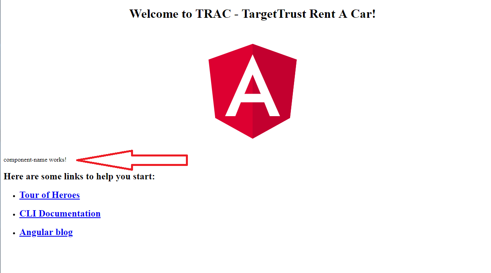

# Aula do dia 23/05/2019 

## Front end
Agora que já vimos boa parte do que precisaremos utilizar para codificação do nosso backend utilizando spring para a construção de uma API REST, agora precisamos nos preocupar com a parte responsável por interagir com nosso usuário, o frontend. 
Aplicações modernas hoje utilizam o conceito de **SPA - *Single Page Application* **.

## SPA - *Single Page Application*
Se você ainda não “brincou” com SPA saiba que está perdendo muito, a técnica é o acrônimo de Single-Page Application, ou aplicação de página única em tradução livre e é construída, básicamente, com HTML, CSS e Javascript. A técnica é a base para se criar aplicações híbridas que funcionam tando no navegador quanto em dispositivos mobile e desktop de forma “nativa”, quero dizer, baixando da store (Google Play e App Store, por exemplo) ou instalando no seu sistema operacional favorito.

Existem muitas formas de criar um SPA, frameworks como Angular, Vue.js e React oferecem excelentes propostas, com sistema de rotas, estado dos dados (Single source of truth), sistema de templates, mas eu estou me adiantando, vamos com calma.

O que de fato é um SPA?
Um SPA é uma aplicação web que roda em uma única página, se assemelhando a um aplicativo desktop ou um mobile, são leigamente chamadas de “páginas ajax”, um bom exemplo que gosto de usar é o Gmail do Google, ele é um SPA, a navegação na aplicação rola toda em uma única página e todo o conteúdo é carregado de uma vez ou obtido dinâmicamente (ou seja, via requisições Ajax).


A aplicação SPA pode ser construída de diversas formas, a mais comum é ser auxiliado por um framework Javascript como Angular ou Vue.js, ambos possuem sistemas de rotas e clientes HTTP para fazer requisições a recursos externos (uma API, por exemplo).

## Angular JS
Angular JS é um framework *open-source* JavaScript para desenvolvimento de aplicações *front-end*. É suportado principalmente pelo google em conjunto com uma extensa comunidade para suprimir todos os desafios do dsenvolvimento de aplicações SPA. 

A principal diferença entre os frameworks SPA e os antigos frameworks de programação web tradicional é que esses frameworks SPA rodam nativamente no browser não necessitando de nenhum componente especial para execução, apenas um browser, enquanto os demais frameworks, como php, jsp, jsf, django, precisam de um *runtime environment* e rodam em *server side* produzindo código html que será então exibido pelo browser.

O angularjs extende o html para prover funcionalidades a mais à aplicação utilzando o que chamamos de componentes e diretivas que veremos em seguida.

## Configurando o ambiente

### Pré requisitos
 * Conhecimento:
   * HTML
   * Javascript
   * CSS
 * Ambiente:
   * NodeJS - Para download do Node.js visite https://nodejs.org.
   * NPM (Node Package Manager) - Gerenciador de pacotes do node, deve ser instalado junto com o nodejs.    
 Após a instalação verificar as versões instaladas:
  * NodeJS: `node --version`
  * NPM: `npm --version``
### Instalando o angular CLI
Angular CLI é a interface de linha de comando utilizzada para criar projetos, gerar a aplicação e executar uma variedade de tarefas de desenvolvimento, como testes, contrução e publicação. 
Para instalar o angular CLI devemos executar o seguinte comando: `npm install -g @angular/cli`

Após a instalação verificar a versão instalada:
```
ng --version
```

### Criando a primeira aplicação de exemplo:
Nós desenvolvemos aplicações dentro de um contexto de *workspace*, que contém os arquivos necessários para um ou mais projetos. Para criar um novo workspace e o código inicial do projeto devemos executar o seguinte comando:
```
ng new meu-app
```
Para rodar a aplicação:
```
cd meu-app
ng serve --open
```

### Explorando o app gerado
Para codificação do app front-end recomendo a utilização do VS Code (Visual Studio Code), ferramenta free desenvolvida pelo microsoft e que possui uma melhor interação com código html e javascript que serão utilizados no treinamento. 
Para baixar a última versão verificar em https://code.visualstudio.com/download.

#### Estrutura de arquivos
Após gerado o código podemos perceber navegando no diretório a seguinte estrutura de pastas "principais":
* e2e - Testes integrados *end to end*
* node_modules - Dependências do projeto
* src - código fonte da aplicação em si
  * app - componentes da aplicação
    * app.module.ts - Arquivo TypeScript que configura todos os módulos e componentes utilizados pela aplicação
    * app.component.ts - TypeScript de configuração do componente principal da aplicação
    * app.component.spec.ts - TypeScript com o teste básico do componente
    * app.component.html - HTML de exibição do componente básico
  * assets - pasta de *assets* como imagens
  * environment - configurações de ambiente de execução
  * index.html - HTML básico da aplicação, a partir dele toda será feita toda a execução do aplicação (SPA lembram?)
 
 ### Exercício
 Criem uma aplicação de teste (fora da estrutura do repositório) e explorem os arquivos gerados dentro do VS Code.
 
 ### Criando nosso primeiro component
 Todo e qualquer componente angular pode ser criado manualmente ou utilizando o utilitário CLI, que cria os arquivos automaticamente e configura o novo componente na aplicação. Para criar um novo componente devemos utilizar o seguinte comando:
 
 ```
 ng generate component component-name
 ```
 
 A saída esperada no console deve ser algo parecido com:
 
 ```
CREATE src/app/marcas-list/component-name.html (30 bytes)
CREATE src/app/marcas-list/component-name.spec.ts (657 bytes)
CREATE src/app/marcas-list/component-name.ts (288 bytes)
CREATE src/app/marcas-list/component-name.css (0 bytes)
UPDATE src/app/app.module.ts (414 bytes) 
 ```
 
 Percebam que toda a estrutura do componente já foi criado e o mesmo já foi adicionado a configuração de módulos da aplicação. Abrindo o conteúdo do arquivo component-name.ts:
 
 ``` ts 
 import { Component, OnInit } from '@angular/core';

@Component({
  selector: 'app-marcas-list',
  templateUrl: './marcas-list.component.html',
  styleUrls: ['./marcas-list.component.css']
})
export class MarcasListComponent implements OnInit {

  constructor() { }

  ngOnInit() {
  }

}
 ``` 
 
 Dentro da configuração **@Component** podemos observar um campo chamado *selector*. Nele temos a definição do que chamamos de *diretiva*, que é a forma com que o angularjs extende o html para prover novas funcionalidades. 
 Podemos utilizar essa diretiva para "usar" nosso componente diretamente no código do nosso principal componente:
 
 
 ``` html 
<!--The content below is only a placeholder and can be replaced.-->
<div style="text-align:center">
  <h1>
    Welcome to {{ title }}!
  </h1>
  
</div>
<div>
  <app-component-name></app-component-name>
</div>
<h2>Here are some links to help you start: </h2>
<ul>
  <li>
    <h2><a target="_blank" rel="noopener" href="https://angular.io/tutorial">Tour of Heroes</a></h2>
  </li>
  <li>
    <h2><a target="_blank" rel="noopener" href="https://angular.io/cli">CLI Documentation</a></h2>
  </li>
  <li>
    <h2><a target="_blank" rel="noopener" href="https://blog.angular.io/">Angular blog</a></h2>
  </li>
</ul>
 ```  
 
 Como resultado podemos ver no browser:
 

 
 
 ### Exercício
 Criem um primeiro componente como no exemplo acima, editem seu html para exibir alguma informação diferente da gerada, incluam esse componente na aplicação e vejam o resultado.
 
 ## Tema de casa
 * Professor:
  1. Criar sqls para popular a base
  2. Criar aulas adicionais para descrever:    
    2.1. Instalação e configuração do postman    
    2.2. Problemas usuais com git    
    2.3. O que é git rebase   
    2.4. Criar seção para descrever correções em sequences e datas
 * Turma:
  1. Instalar e configurar o angular CLI em suas máquinas
  2. Criar uma aplicação de teste
  3. Repetir os exercícios feitos em sala
 
 
 


