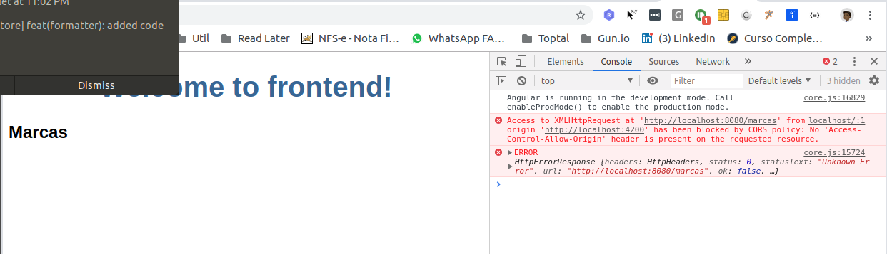

# Aula do dia 30/05/2019 

# Angular Services

O componente marcas atualmente está pegando e exibindo dados *fakes*. Depois do refactoring da aula de hoje, os componentes estarão focados em suportar as chamadas a nossa API de backend. 

## Porque services?

Componentes não deveria buscar ou salvar dados diretamente e eles certamente não deveriam apresentar dados *fake*. Eles deveria focar em apenas apresentar os dados e delegar o acesso a esses dados a um serviço especializado. 

Na aula de hoje criaremos um **MarcaService** que todas as classes da aplicação podem utilizar para buscar as marcas. Ao invés de criar um serviço com o operador *new* utilizaremos a feature de *dependency injection* do Angular para injetar o serviço nos componentes que irão utilizá-lo.

Services são um ótimo meio para compartilhar informações entre as classes que *não se conhecem*. Dessa forma também trabalharemos com mensagens para que possamos usar serviços para enviar mensagens e ler as mesmas em um outro componente. 


## Criando o service
Utilizando o Angular CLI, gere um novo service chamado `marca`:

``` 
ng generate service services/marca
```

O CLI gera um novo diretório chamado `services` dentro de `src/app`, e gera os 2 arquivos para o novo service. 
A classe principal do novo service:

``` ts
import { Injectable } from '@angular/core';

@Injectable({
  providedIn: 'root'
})
export class MarcasService {

  constructor() { }
}
```

## @Injectable() services
Note que o novo service importa o símbolo *Injectable* e anota a classe com *@Injectable*. Isto marca a classe como uma das participantes do sistema de injeção de dependências. A classe **HeroService** terá um service injetável, e também poderá ter suas próprias dependências injetadas. Nós ainda não temos dependências, mas teremos em breve.

## Servindo o novo `service`
Para que o MarcasService esteja disponível no nosso MarcasComponent precisamos importá-lo corretamente no arquivo e injetá-lo no contrutor:

```ts
import { Component, OnInit } from '@angular/core';
import { Marca } from '../entidades/marca';
import { MARCAS } from '../mock/marcas-mock';
import { MarcasService } from '../services/marcas.service';

@Component({
  selector: 'app-marcas',
  templateUrl: './marcas.component.html',
  styleUrls: ['./marcas.component.css']
})
export class MarcasComponent implements OnInit {

  entities : Marca[];
  selectedEntity : Marca;

  constructor(private marcasService : MarcasService) { }

  ngOnInit() {
    this.getMarcas();
  }

  getMarcas() {
    this.entities = this.marcasService.getMarcas();
  }

  select(entity) {
    this.selectedEntity = entity;
  }
}
```

## Trabalhando de forma assíncrona

O método *MarcasService.getMarcas()* tem uma assinatura síncrona, isto é, executa de forma bloqueante na mesma thread que a invocou. O componente *MarcasComponent" consome o método de forma síncrona conforme esperado: 

```ts
    this.entities = this.marcasService.getMarcas();
```
Isto não funcionaria em uma aplicação real. Estamos trabalhando dessa forma pois ainda estamos trabalhando com dados *fake*, mocados. Mas em breve a aplicação riá buscar as marcas de um servidor remoto, o que deve ser feito de forma asíncrona.

O *HeroService* deve aguardar o servidor responder, o método `getMarcas()`pode não retornar imediatamente os dados necessários, e o browser não bloqueará enquanto o seriço aguarda a conclusão da operação.

Usualmente este tipo de processo é feito de forma assíncrona, com o que chamamos de `callback`. 

### Observables

`Observable` é uma das classes principais do pacote [RxJS library](http://reactivex.io/rxjs/). 
Abra o service e import os componentes `Observable`e `of` do pacote RxJS:    
```ts
import { Observable, of } from 'rxjs';
```
Substitua o retorno do método getMarcas por um Observable:
```ts
  getMarcas() : Observable<Marca[]> {
    return of(MARCAS);
  }
```

## Trabalhando com callbacks
Callbacks são funções de retorno em chamadas assíncronas. Para que um determinado processamento seja executado no retorno de uma chamada assíncrona devemos passar a função como parâmetro do método subscribe em um `Observable`:

```ts
  getMarcas() {
    this.marcasService.getMarcas().subscribe(
      marcas => this.entities = marcas
    );
  }
```

Na sintaxe utilizada acima, `marcas`é o nome do atributo retornado pelo `Observable` e o trecho após o operador `=>` é o que será executado no callback.

## Trabalhando com APIs REST

`HttpClient`é o mecanismo padrão para comunicação com um servidor remoto através do protocolo HTTP.
Para torná-lo diponśivel em toda a aplicação devemos importá-lo no arquivo `src/app/app.module.ts`:
```ts
import { HttpClientModule } from '@angular/common/http';
```
e importálo no array @NgModule.imports:
```ts
  imports: [
    BrowserModule,
    AppRoutingModule,
    FormsModule,
    HttpClientModule
  ]
```

### Integrando o service na API:

No service MarcasService precisamos importar alguns elementos do pacote http:

```ts
import { HttpClient, HttpHeaders } from '@angular/common/http';
```

Injetamos um `HttpClient` no construtor:
```ts
  constructor(private http: HttpClient) { }
```

e alteramos a lógica do método getMarcas para invocarmos a API:
```ts
  getMarcas() : Observable<Marca[]> {
    return this.http.get<Marca[]>('http://localhost:8080/marcas');
  }
```

Com o backend iniciado vejamos como a lista de marcas é retornada:




A seguinte mensagem de erro é mostrada no console:
```
Access to XMLHttpRequest at 'http://localhost:8080/marcas' from origin 'http://localhost:4200' has been blocked by CORS policy: No 'Access-Control-Allow-Origin' header is present on the requested resource.
```

Isso se deve a uma restrição de segurança implementada pelos browsers que impede que um aplicativo que esteja servindo em um endereço acesse APIs em outro endereço. No nosso caso, estamos servindo o frontend na porta 4200 de localhost e tentando acessar uma api na porta 8080 de localhost. 

Essa regra é uma política de segurança. Como devemos proceder para solucionar o problema? 

## Configurando um proxy
Precisamos criar um mecanismo onde nosso servidor http exerça um papel de proxy, isto é, receba as requisições dos clientes e as repasse para o bakcend. É possível fazermos isso incluindo um arquivo na raíz do projeto chamado `proxy.config.json`, com o seguinte formato:

```json
{
    "/api/*": {
      "target": "http://localhost:8080/",
      "secure": false,
      "logLevel": "debug",
      "changeOrigin": true
    }
}
```

Caso o arquivo tenha sido criado na pasta src devemos movê-lo para a raiz do projeto com o comando:
```
 mv src/proxy.config.json ./proxy.config.json
```
Isto indica ao angular que nosso backend está servindo na porta de localhost. Para iniciar nosso servidor com o proxy configurado precisamos adicionar um parâmetro:

```
ng serve --proxy-config proxy.config.json --open
```

Mas mesmo asim, a chamada retornou 404 - Not Found. 

Isto se dá porque o proxy do angular tenta `repassar` ao backend uma requisição exatamente igual a que recebeu, portanto ele espera que o path da requisição serja `http:localhost:8080\api`e não `http:localhost:8080`, como estamos trabalhando no backend. 

Para resolver este problema precisamos incluir a seguinte configuração a nossa aplicação de backend:

```
server.servlet.context-path=/api
```

**IMPORTANTE**: AS chamadas do postman deverão ser alteradas para contemplar a nova URL, do contrário não funcionarão.

Agora basta atualizarmos a chamada do marca-service para a nova API utilizando a URL do proxy, conforme segue/:
```ts
...
export class MarcaService {
  ...
  getMarcas() : Observable<Marca[]> {
    return this.http.get<Marca[]>('/api/marcas');
  }
  ...
}
```


## Salvando dados (PUT, POST, DELETE)

Para acessar os demais métodos também precisamos utilizar a mesma estratégia do get, porém com diferentes retornos. Vamos analisar o método de atualizar uma marca. 

``` java
	@PostMapping(value="/{id}", consumes = MediaType.APPLICATION_JSON_UTF8_VALUE)
	public HttpEntity<Marca> updateMarca(@PathVariable("id") Long id, 
			@Valid @RequestBody Marca marca) {
		if(!id.equals(marca.getId())) {
			ResponseEntity.badRequest().build();
		}
		Optional<Marca> dbMarca = marcaRepository.findById(id);
		if(dbMarca.isPresent()) {
			return ResponseEntity.ok(marcaRepository.save(marca));
		}
		return ResponseEntity.notFound().build();		
	}
```

Precisamos receber o id como path variable, e um json com os dados da marca no corpo da requisição e devemos receber uma marca como retorno da execução, sendo assim, o método no service ficará:

```ts
  ...

  httpOptions = {
    headers: new HttpHeaders({
      'Content-Type':  'application/json'
    })
  };
  ...
  save(marca : Marca) : Observable<Marca> {
    var url = 'api/marcas/'+marca.id;
    return this.http.post<Marca>(url, marca, this.httpOptions);
  }
```

Note que precisamos definir um atributo chamado httpOptions com informações pertinentes a requisção, como o formato do request (json).

No controller ao chamar o método devemos subscrever no Observable para podermos ser notificados da execução finalizada (callback) : 

``` ts
  save() {
    this.marcasService.save(this.selectedEntity)
      .subscribe( marca => this.selectedEntity = marca);
  }
```

No callback apenas precisamos atualiar os dados da entidade com os dados retornados do servidor.
Por fim, na tela, basta incluirmos um botão com a chamada a função do componente:

```html
<div *ngIf="selectedEntity" >
  <h3>Edição de Marca</h3>
  <label>
    Nome: 
    <input type="text" placeholder="Nome" [(ngModel)]="selectedEntity.nome"/>
  </label>
  <button (click)="save()">OK</button>
</div>
```
