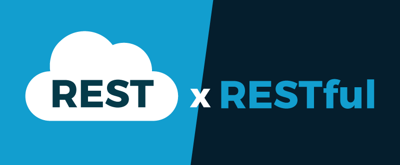

# REST (*Representational State Transfer*)

## API (*Application Programming Interface*)
É cada dia mais comum termos aplicações que funcionem única e exclusivamente pela Internet, sendo consumidas por navegadores em desktops, notebooks ou dispositivos móveis, isto é, independente de plataforma.  Por outro lado, grandes empresas precisam alimentar seus softwares de gestão (estoque, contabilidade, ERP e redes sociais) com dados, a todo momento.

Com essas duas problemáticas em mente (sofwares sendo acessados pela Web e empresas precisando alimentar seus sistemas) começou-se a pensar em uma solução de sofware que permitisse a conversa entre sistemas e usuários.

Durante anos, diversas alternativas surgiram e, de uma forma geral, essas aplicações ficaram conhecidas como APIs. Basicamente, o funcionamento dessas aplicações baseava-se em fornecer um ponto de acesso entre a aplicação e seu cliente, seja ele um usuário ou uma outra aplicação.

### O que é API?
O acrônimo API que provém do inglês *Application Programming Interface* (Em português, significa Interface de Programação de Aplicações), trata-se de um conjunto de rotinas e padrões estabelecidos e documentados por uma aplicação A, para que outras aplicações consigam utilizar as funcionalidades desta aplicação A, sem precisar conhecer detalhes da implementação do software.

Desta forma, entendemos que as APIs permitem uma interoperabilidade entre aplicações. Em outras palavras, a comunicação entre aplicações e entre os usuários.


### Representações
Agora que já sabemos que uma API permite a interoperabilidade entre usuários e aplicações, isso reforça ainda mais a importância de pensarmos em algo padronizado e, de preferência, de fácil representação e compreensão por humanos e máquinas. Isso pode soar um pouco estranho, mas veja esses três exemplos:

* XML: 

```XML
<endereco>
  <rua>
    Rua Recife
  </rua>
  <cidade>
    Paulo Afonso
  </cidade>
</endereco>
```
 * Json
```json
{ endereco:
  {
  rua: Rua Recife,
  cidade: Paulo Afonso
  }
}
```
* YAML
```yaml
endereco:
rua: rua Recife
cidade: Paulo Afonso
```
Qual deles você escolheria para informar o endereço em uma carta? Provavelmente o último, por ser de fácil entendimento para humanos, não é mesmo? Contudo, as 3 representações são válidas, pois nosso entendimento final é o mesmo, ou seja, a semântica é a mesma.

Por outro lado, você deve concordar comigo que a primeira representação (formato XML) é mais verbosa, exigindo um esforço extra por parte de quem está escrevendo. No segundo exemplo (formato JSON) já é algo mais leve de se escrever. Já o último (formato YAML), é praticamente como escrevemos no dia a dia.

Sendo assim, esse é o primeiro passo que precisamos dar para permitir a comunicação interoperável. E o mais legal é que essas 3 representações são válidas atualmente, ou seja, homens e máquinas podem ler, escrever e entender esses formatos.

## Origem do REST
O HTTP é o principal protocolo de comunicação para sistemas Web, existente há mais de 20 anos, e em todo esse tempo sofreu algumas atualizações. Nos anos 2000, um dos principais autores do protocolo HTTP, Roy Fielding, sugeriu, dentre outras coisas, o uso de novos métodos HTTP. Estes métodos visavam resolver problemas relacionados a semântica quando requisições HTTP eram feitas.

Estas sugestões permitiram o uso do HTTP de uma forma muito mais próxima da nossa realidade, dando sentido às requisições HTTP. Para melhor compreensão, veja os exemplos abaixo (requisições em formatos fictícios):

```
GET http://www.meusite.com/usuarios
DELETE http://www.meusite.com/usuarios/jackson
POST http://www.meusite.com/usuarios –data {nome: joaquim}
```

Pela simples leitura (mesmo o método GET e DELETE sendo em inglês) é possível inferir que no primeiro caso estamos pegando (GET) todos os usuários do site, ou seja, teremos uma lista de todos os usuários que estão cadastrados no sistema/site. Já, no segundo caso, estamos apagando (DELETE) o usuário Jackson. No último exemplo, estamos usando o método POST, em que percebemos o envio de dados extras para cadastrar um novo usuário.

Veja o quão simples ficou expressar o que desejamos realizar ao acessar um determinado endereço, usando verbos específicos para URLs específicas e usando dados padronizados, quando necessário.

Estes princípios apresentados fazem parte do REST! Em outras palavras, nesses exemplos, temos: uma representação padronizada, verbos e métodos usados, bem como, URLs.

## O que é REST
REST significa Representational State Transfer. Em português, Transferência de Estado Representacional. Trata-se de uma abstração da arquitetura da Web. Resumidamente, o REST consiste em princípios/regras/constraints que, quando seguidas, permitem a criação de um projeto com interfaces bem definidas. Desta forma, permitindo, por exemplo, que aplicações se comuniquem.

### E RESTful… qual a diferença?



Existe uma certa confusão quanto aos termos REST e RESTful. Entretanto, ambos representam os mesmo princípios. A diferença é apenas gramatical. Em outras palavras, sistemas que utilizam os princípios REST são chamados de RESTful.

* **REST**: conjunto de princípios de arquitetura
* **RESTful**: capacidade de determinado sistema aplicar os princípios de REST.

## Projetando uma API Rest
Para definirmos a estrutura de nossa API precisamos primeiramente definir os nossos recursos. Recursos são todas as estruturas que serão expostas ao nosso usuário atraveś da nossa API, por exemplo, veiculo, equipamento, cliente e funcionários são recusros do nosso sistema de locação de veículos. 
REST é um conjunto de princípios que definem como Web Standards como HTTP e URIs devem ser usados (o que freqüentemente difere um pouco do que muitas pessoas atualmente fazem). A promessa é que se você aderir a princípios REST enquanto estiver desenhando sua aplicação, você terá um sistema que explora a arquitetura da Web em seu benefício. Em resumo, os cinco princípios fundamentais são os seguintes:
### 1. Dê a todas as coisas um Identificador
Eu estou usando o termo "coisas" ao invés do termo formalmente correto "recurso" porque esse é um principio simples que não deveria ser escondido por trás da terminologia. Se você pensar sobre os sistemas que as pessoas constroem, há usualmente um conjunto de abstrações chave que merecem ser identificadas. Tudo o que deveria ser identificado deveria obviamente ter um ID - Na Web, há um conceito unificado para IDs: A URI. URIs compõe um namespace global,e utilizando URIs para identificar seus recursos chave significa ter um ID único e global.

O principal beneficio de um esquema de nomes consistente para as coisas é que você não tem que criar o seu próprio esquema - você pode confiar em um que já tenha sido definido, trabalha muito bem em escala global e é entendido por praticamente qualquer um. Se você considerar um objeto arbitrário de alto nível com a última aplicação que você construiu (assumindo que não foi construído de forma RESTful), e quase certo que havia muitos casos de uso onde você deve ter lucrado com isso. Se a sua aplicação incluir uma abstração de Cliente, por exemplo, eu estou quase certo de que os usuários gostariam de poder enviar um link para um determinado cliente via e-mail, para um colega de trabalho, criar um favorito para ele no seu navegador, ou mesmo anotá-la em um pedaço de papel. Para esclarecer melhor, imagine que decisão de negócio terrivelmente ruim teria sido se uma loja on-line como a amazon.com não identificasse cada um dos seus produtos com um ID único (uma URI).

Quando confrontados com essa idéia, muitas pessoas se perguntam se isso significa que devem expor suas entradas de banco de dados (ou seus IDs) diretamente - e frequentemente ficam revoltadas pela simples idéia, uma vez que anos de prática de orientação a objetos nos disseram para esconder os aspectos de bancos de dados. Por exemplo, um recurso de Pedido poderia ser composto de itens de pedido, um endereço e muitos outros aspectos que você poderia não querer expor como um recurso identificável individualmente. Tomando a idéia de identificar de tudo o que vale a pena a ser identificado, leva à criação de recursos que você normalmente não vê, em um típico design de aplicação: Um processo ou um passo de um processo, uma venda, uma negociação, uma solicitação de quotação - estes são todos exemplos de "coisas" que precisam ser identificadas. Isto, por sua vez, pode levar à criação de entidades mais persistentes do que em um design não RESTful.

Alguns exemplos exemplos de URIs que poderíamos ter:

```
http://example.com/customers/1234
http://example.com/orders/2007/10/776654
http://example.com/products/4554
http://example.com/processes/salary-increase-234 
```
Como eu escolhi criar URIs que possam ser lidas por seres humanos - um conceito útil, mesmo que não seja um pré-requisito para um design RESTful - deve ser bastante fácil de adivinhar seu significado: Elas obviamente identificam "itens" individuais. Mas dê só uma olhada nestas:

```
http://example.com/orders/2007/11
http://example.com/products?color=green 
```
No início, isso pode parecer algo diferente - afinal de contas, eles não são a identificação de um recurso, mas um conjunto de coisas (assumindo que a primeira URI identifica todos os pedidos submetidos em novembro de 2007, e a segunda, um conjunto de produtos verdes). Mas esses conjuntos são realmente coisas - recursos - os por si só, e eles definitivamente precisam ter um identificador.

Note os benefícios de se ter um único esquema de nomes a nível global aplicável tanto para a Web em seu navegador como para comunicação de máquina para máquina.

Para resumir o primeiro princípio: Use URIs para identificar tudo o que precisar ser identificado, especifique todos os recursos de "alto nível" que seu aplicativo oferece, se eles representam itens individuais, conjuntos de itens, objetos virtuais e físicos, ou resultados de computação.

### 2. Vincule as coisas

O próximo princípio que veremos tem uma descrição formal que intimida um pouco: "Hipermídia como motor do estado do aplicativo", as vezes abrevido como HATEOAS. (*Hypermedia as the Engine of Application State*) No seu núcleo está o conceito de hipermídia, ou em outras palavras: links. Links são algo que nós estamos familiarizados no HTML, mas eles não são de forma alguma restritos ao consumo de humanos. Considere o seguinte fragmento XML:

```XML
<order self="http://example.com/customers/1234"> 
   <amount>23</amount> 
   <product ref="http://example.com/products/4554"></product> 
   <customer ref="http://example.com/customers/1234"></customer> 
</order>
```
Se você observar os links de produto (product) e cliente (customer) nesse documento, você poderá facilmente imaginar como um aplicativo que o tenha obtido pode interpretar os links para obter mais informações. Evidentemente, este seria o caso se houvesse um simples atributo identificador aderindo a algum esquema de nomeclatura específica de um aplicativo, também - Mas apenas no contexto do aplicativo. TA beleza da abordagem de links com URIs é que os links podem apontar para recursos que são oferecidos por uma aplicação diferente, um outro servidor, ou até mesmo em uma empresa diferente em outro continente - porque o esquema de nomes é um padrão global, todos os recursos que compõe a Web podem ser ligados uns aos outros.

THá um aspecto ainda mais importante do princípio de hipermídia - a parte de estado do aplicativo. Em suma, o fato de que o servidor (ou provedor de serviços, se você preferir) oferece um conjunto de links para o cliente (o consumidor do serviço), permite ao cliente mudar o aplicativo de um estado para outro, através de um link. Nós vamos observar os efeitos deste aspecto em outro artigo, em breve, por enquanto, tenha em mente que os links são extremamente úteis para fazer uma aplicação dinâmica.

Para resumir esses principios: Use liks para referênciar coisas que possam ser identificadas (recursos) sempre que for possível. Hiperlinks são o que fazem a Web ser a Web.

### 3. Utilize métodos padronizados

Havia um pressuposto implícito na discussão dos primeiros dois princípios: a aplicação consumidora pode realmente fazer algo significativo com URIs. Se você ver uma URI escrita na lateral de um ônibus, você pode inserí-la na barra de endereços no seu navegador e presionar enter - mas como é que o seu navegador sabe o que fazer com a URI?

Ele sabe o que fazer com ela, porque todos os recursos possuem a mesma interface, e o mesmo conjunto de métodos (ou operações, se preferir). O HTTP chama esse verbo, e além dos dois que todo mundo conhece (o GET e o POST), o conjunto de métodos padrão inclui PUT, DELETE, HEAD e OPTIONS. O significado de cada um desses métodos é definido na especificação do HTTP, juntamente com algumas garantias sobre o seus comportamentos. 

As operações mais comuns em recursos são as seguintes:    

| Inicial **CRUD** |  Operação  |                 Descrição                 | *HTTP Verb* |
|:----------------:|:----------:|:-----------------------------------------:|:-----------:|
|       **C**      |  *Create*  | Criar uma nova instância do recurso       |     POST    |
|       **R**      | *Retrieve* | Pesquisar dados em um formato conveniente |     GET     |
|       **U**      |   *Update* | Atualizar dados                           |     PUT     |
|       **D**      |  *Delete*  | Deletar um recurso                        |    DELETE   | 


### 4. Trabalhe com os códigos de retorno *default*
Toda requisição HTTP possui um código de retorno, sendo ela bem sucedida ou não. Os códigos de erro possuem os seguintes agrupamentos:

 * 1xx - informação
 * 2xx - sucesso
 * 3xx - redirecionamento
 * 4xx - erro do lado do cliente
 * 5xx - erro do lado do servidor

 Para maiores detalhes dos códigos de erro, favor referenciar esse [link](https://en.wikipedia.org/wiki/List_of_HTTP_status_codes).


### 5. Comunique sem estado
O último princípio que eu gostaria de abordar é a comunicação sem estado. Primeiramente, é importante salientar que embora REST inclua a ídeia de "não manter", isso não significa que o aplicativo que exponha suas funcionalidades não possa ter estado - de fato, isso tornaria a abordagem inútil na maioria dos cenários. REST exige que o estado seja transformado no estado do recurso ou mantido no cliente. Em outras palavras, um servidor não deveria guardar o estado da comunicação de qualquer um dos clientes que se comunique com ele além de uma única requisição. A razão mais óbvia para isso é escalabilidade - o número de clientes que podem interagir com o servidor seria consideravelmente impactado se fosse preciso manter o estado do cliente. (Note que isso geralmente requer um pouco de re-design - você não pode simplesmente manter um URI com algumas sessões com estado e chamar isso de RESTful.)

Mas existem outros aspectos que poderiam ser muito mais importantes: As restrições de "não manter" isolam o cliente de mudanças no servidor, dessa forma, duas solicitações consecutivas não dependem de comunicação com o mesmo servidor. Um cliente poderia receber um documento contendo links do servidor, e então faria algum processamento, e o servidor poderia ser desligado, e o disco rígido poderia ser jogado fora ou substituído, e o software poderia ser atualizado e reiniciado - e se o cliente acessase um dos links recebidos do servidor, ele não teria nem percebido.
