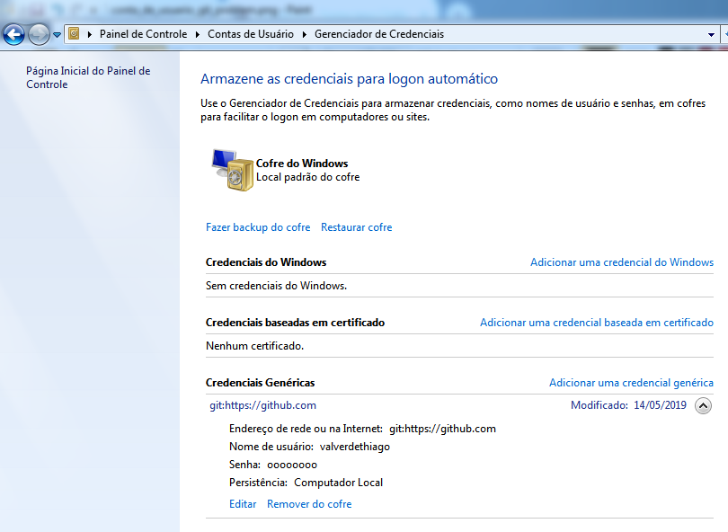

# Problemas recorrentes com git
Vimos na aula que podemos enfrentar alguns problemas recorrentes com git, principalmente quando compartilhamos máquinas com outras pessoas e utilizamos o mesmo usuário. 

## Git For Windows
O `git-for-windows` trabalha com algumas variáveis de ambiente e configurações de usuário para vincluar o usuário do repositório ao usuário da máquina e não ficar solicitando as credenciais de acesso em toda operação. Muitas vezes tivemos erro de validação de credenciais pois o usuário de outro curso informou suas credenciais na mesma máquina e este não tem acesso ao nosso repositório. Como resolver?

Precisamos remover as credenciais do github do *cofre* do usuário. Para isso basta acessarmos esta área no Painel de Controle pesquisando por `Contas de Usuário` no menu iniciar, e indo em Gerenciador de credenciais:



## Problemas ao executar o pull

Quando temos arquivos alterados localmente e tentamos executar um `git pull` para buscar as últimas alterações no repositório remoto, temos uma mensagem de erro informando que há alterações locais que precisam ser comitadas. Isto ocorre devido:
1. existem alterações locais que não foram colocadas em **staging**
2. existem commits na área de **staging** que não foram sincronizados com o repositório remoto.

No primeiro caso basta executarmos o seguinte comando:

```
git clean -fd
```

**IMPORTANTE: As alterações locais serão perdidas**


```
git reset --hard
```

**IMPORTANTE: As alterações locais serão perdidas**

