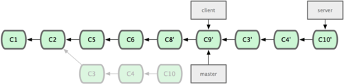
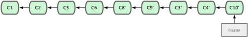

# Ramificação (Branching) no Git - Rebase

## Rebasing
No Git, existem duas maneiras principais de integrar mudanças de um branch em outro: o merge e o rebase. Nessa seção você aprenderá o que é rebase, como fazê-lo, por que é uma ferramenta sensacional, e em quais casos você não deve usá-la.

### O Rebase Básico
Se você voltar para o exemplo anterior na seção de merge (veja figura abaixo), você pode ver que você criou uma divergência no seu trabalho e fez commits em dois branches diferentes.


A maneira mais fácil de integrar os branches, como já falamos, é o comando merge. Ele executa um merge de três vias entre os dois últimos snapshots (cópias em um determinado ponto no tempo) dos branches (C3 e C4) e o mais recente ancestral comum aos dois (C2), criando um novo snapshot (e um commit), como é mostrado abaixo.


Porém, existe outro modo: você pode pegar o trecho da mudança que foi introduzido em C3 e reaplicá-lo em cima do C4. No Git, isso é chamado de rebasing. Com o comando `rebase`, você pode pegar todas as mudanças que foram commitadas em um branch e replicá-las em outro.

Nesse exemplo, se você executar o seguinte:

```
$ git checkout experiment
$ git rebase master
First, rewinding head to replay your work on top of it...
Applying: added staged command
```
Ele vai ao ancestral comum dos dois branches (no que você está e no qual será feito o rebase), pega a diferença (diff) de cada commit do branch que você está, salva elas em um arquivo temporário, restaura o brach atual para o mesmo commit do branch que está sendo feito o rebase e, finalmente, aplica uma mudança de cada vez. A figura abaixo ilustra esse processo:


Nesse ponto, você pode ir ao branch master e fazer um merge fast-forward (Figura 3-30).


Agora, o snapshot apontado por C3' é exatamente o mesmo apontado por C5 no exemplo do merge. Não há diferença no produto final dessas integrações, mas o rebase monta um histórico mais limpo. Se você examinar um log de um branch com rebase, ele parece um histórico linear: como se todo o trabalho tivesse sido feito em série, mesmo que originalmente tenha sido feito em paralelo.

Constantemente você fará isso para garantir que seus commits sejam feitos de forma limpa em um branch remoto — talvez em um projeto em que você está tentando contribuir mas não mantém. Nesse caso, você faz seu trabalho em um branch e então faz o rebase em `origin/master` quando está pronto pra enviar suas correções para o projeto principal. Desta maneira, o mantenedor não precisa fazer nenhum trabalho de integração — somente um merge ou uma inserção limpa.

Note que o snapshot apontado pelo o commit final, o último commit dos que vieram no rebase ou o último commit depois do merge, são o mesmo snapshot — somente o histórico é diferente. Fazer o rebase reproduz mudanças de uma linha de trabalho para outra na ordem em que foram feitas, já que o merge pega os pontos e os une.

###Rebases Mais Interessantes
Você também pode fazer o rebase em um local diferente do branch de rebase. Veja o histórico na Figura 3-31, por exemplo. Você criou um branch tópico (server) no seu projeto para adicionar uma funcionalidade no lado servidor e fez o commit. Então, você criou outro branch para fazer mudanças no lado cliente (client) e fez alguns commits. Finalmente, você voltou ao ser branch server e fez mais alguns commits.


Digamos que você decide fazer um merge das mudanças entre seu branch com mudanças do lado cliente na linha de trabalho principal para lançar uma versão, mas quer segurar as mudanças do lado servidor até que elas sejam testadas melhor. Você pode pegar as mudanças que não estão no servidor (C8 e C9) e incluí-las no seu branch master usando a opção `--onto` do `git rebase`:
```
$ git rebase --onto master server client
```
Isto basicamente diz, "Faça o checkout do branch client, verifique as mudanças a partir do ancestral em comum aos branches `client` e `server`, e coloque-as no master.” É um pouco complexo, mas o resultado, mostrado na figura abaixo, é muito legal:


Agora você pode avançar (fast-forward) seu branch master (veja Figura 3-33):
```
$ git checkout master
$ git merge client
```


Digamos que você decidiu obter o branch do seu servidor também. Você pode fazer o rebase do branch do servidor no seu branch master sem ter que fazer o checkout primeiro com o comando git rebase [branchbase] [branchtopico] — que faz o checkout do branch tópico (nesse caso, server) pra você e aplica-o no branch base (master):
```
$ git rebase master server
```
Isso aplica o seu trabalho em server após aquele existente em master, como é mostrado abaixo:



Em seguida, você pode avançar seu branch base (master):
```
$ git checkout master
$ git merge server
```
Você pode apagar os branches `client` e `server` pois todo o trabalho já foi integrado e você não precisa mais deles, deixando seu histórico de todo esse processo parecendo com a figura abaixo:

$ git branch -d client
$ git branch -d server



